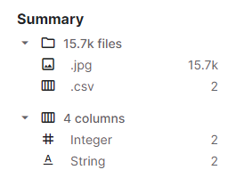
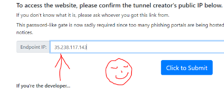
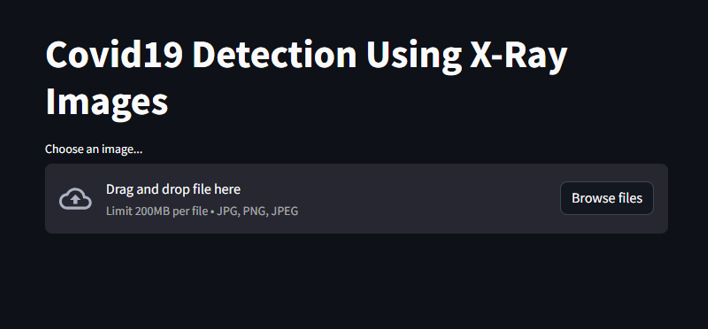
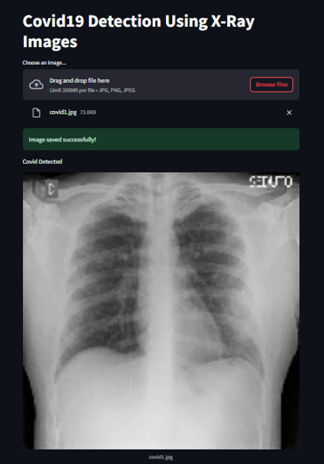

# Covid19_detection_using_Xray_img
### Detecting COVID-19 From Chest X-Ray Images using CNN
This project aims to develop and implement a convolutional neural network (CNN) model for the detection of COVID-19 from chest X-ray images, creating a precise and efficient model that can significantly contribute to the early and accurate diagnosis of COVID-19, thereby facilitating effective patient management and curbing the transmission of the disease.

By training a CNN model on a large dataset of chest X-ray images, consisting of COVID-19-positive and negative cases, we seek to establish a reliable and efficient method for COVID-19 detection. The trained model will be able to classify new chest X-ray images as either COVID-19-positive or negative, thereby aiding healthcare professionals in making timely and informed decisions.

## Dataset
Download the dataset from this Kaggle compitition: [https://www.kaggle.com/datasets/prashant268/chest-xray-covid19-pneumonia/data](https://www.kaggle.com/c/stat946winter2021/overview)

#### Dataset Description
1- train: Contains the train set images. This directory consists of 15264 jpg files. Each image has a unique name.

2- test: Contains the test set images. This directory consists of 400 jpg files. Each image has a unique name.

3- train_labels.csv Is a CSV file with two columns. The first column indicates images name in train set and the second column indicates the label of images. The labels are either 1 or 0. (1 for positive samples and 0 for negative samples). Note that the dataset is unbalanced and almost only 10% of the samples are positive and you need to handle unbalanced data in this challenge.

4- sample_submission.csv: is the sample submission file which your submitted results must be similar to this file. Like the train_labels.csv file, this file also has two columns where the first column of it indicates the ids of the test samples and the second column indicates the predicted labels of your model. After training your model, you should create a file similar to this file and submit it here for this competition.

#### Dataset Summary

    

### [My Model](https://drive.google.com/file/d/1PBzSR21WlkbKvq6snH5WLGcK8g4Mechq/view?usp=sharing) :- Google Drive

### To run the StreamLit (Localtunnel) on Colab or online notebooks
1. Install and run the localtunnel code. (Last part of the Notebook)
2. Within the log.txt file there are the URLs which can be used for creating the tunel. Copy only the External URL IP without the Port. (Eg : 35.238.117.143)
3. Open the IPv4 address link
4. Paste it in the Endpoint IP field.

    

## OUTPUT

    

    

### 🐚✨ **Author**:-
### [Linkedin](https://www.linkedin.com/in/dhyey-shrimankar-298855247/)
### [GitHub](https://github.com/Dhyey3187)
